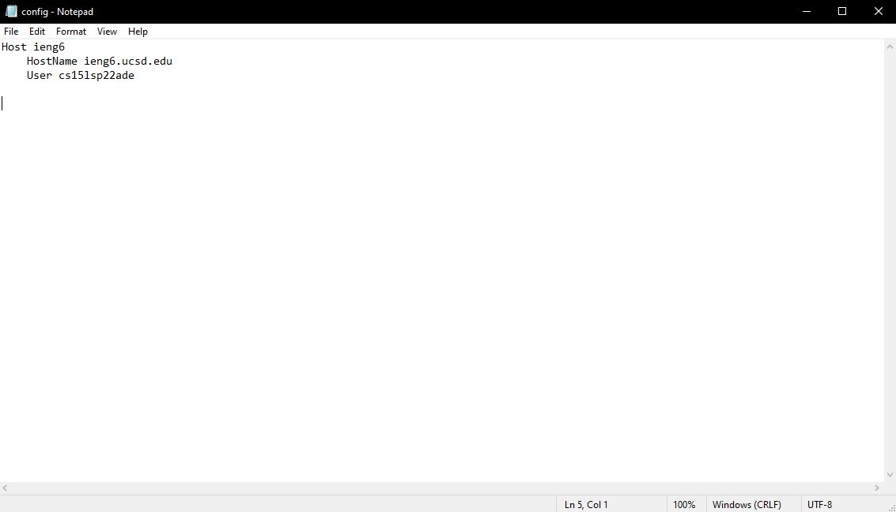
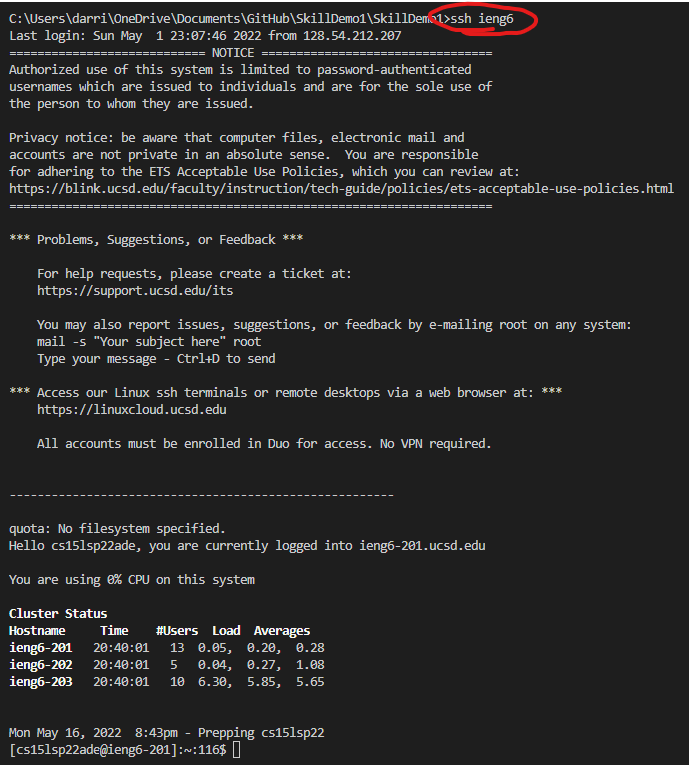
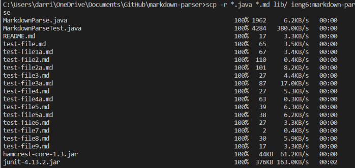
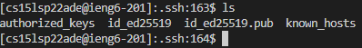
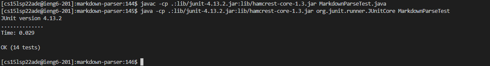

# Lab Report 6

## Part 1: Streamlining SSH configuration

I opened ```~/.ssh/config``` on my computer and added these lines using notepad. After saving the changes, I can now use just the command ```ssh ieng6``` to log into my account as shown below: 

Here is an example of the SSH configuration being used with an SCP command: 

## Part 2: Setup Github Access from ieng6

Here is where my private key is stored on the remote server: 

Now this is where the public key is stored on github: 

## Part 3: Copy whole directories with scp -r

Here is an example of copying an entire directory with ``` scp -r ```: 

Now here it is compiling and running the tests for my repo: 

